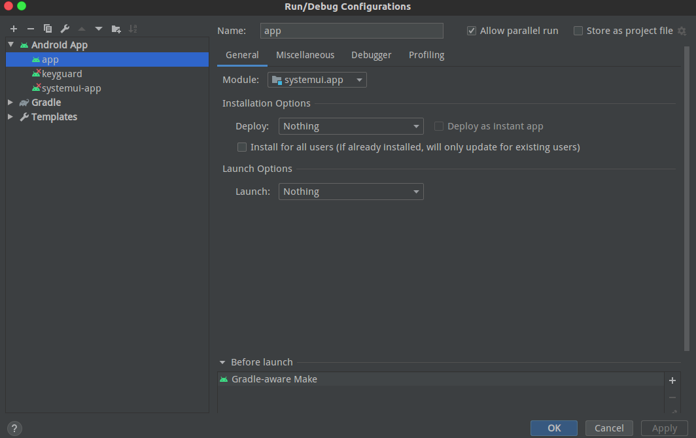

[TOC]


记录将systemUI移入andorid studio 的步骤

# 在AS中创建新项目

## 创建新项目

选择No Activity
包名：com.android.systemui

##  复制源代码,AS配置引用

   在新建的项目文件夹下新建一个文件夹名字SystemUI_src,将源代码复制到SystemUI_src下

   在app/buid.gradle的andorid {}內添加

   ```gradle
      sourceSets {//1
           main {//2
               res.srcDirs = [//3
                       '../SystemUI_SRC/vendor/overlay/prttech/prtos/SystemUI/res',
           ]
   
           java.srcDirs = [//4
                   'src/main/java',	
                   '../SystemUI_SRC/vendor/src',
                   '../SystemUI_SRC/src',	
                   '../SystemUI_SRC/vendor/ex-interface',
                   '../car-lib/src',
                   '../car-lib/src_feature_current',
           ]
           manifest.srcFile '../SystemUI_SRC/AndroidManifest.xml'	//5
           }
           gm521s {//2
               res.srcDirs = [
                       '../SystemUI_SRC/res',
               ]
           }
       }
   ```

   + //1 sourceSets指定java, res,manifest等文件所在路径

   + //2 main 是默认标签,gm521s是productFlavors 中的一个选择项,如果是andorid 原生代码,不存在OVERLAYS,则不需要gm521s.

   + //3 res.srcDirs  指定res文件路径,来源源代码目录下的Android.mk中的LOCAL_RESOURCE_DIR,

```makefile
     LOCAL_RESOURCE_DIR :=$(LOCAL_PATH)/vendor/overlay/$(LOCAL_PATH)/res-keyguard $(LOCAL_PATH)/vendor/overlay/$(LOCAL_PATH)/res 
     LOCAL_RESOURCE_DIR += $(LOCAL_PATH)/res-keyguard $(LOCAL_PATH)/res
```


     SystemUI_SRC/res 和SystemUI_SRC/vendor/overlay下的由于是OVERLAYS关系,两份res存在很多相同资源,故借用productFlavors的方法让两份资源共存.(由于OVERLAYS和productFlavors 不是完全一样,res文件夹需要微调,之后说明)
    
     LOCAL_RESOURCE_DIR除了上述两个路径外还有两个res-keyguard 路径这个为什么没有一起放进来?这个跟systemui演变有关系,早期的android版本systemui和Keyguard是两个独立的app,后来才慢慢的合并成一个,所以在res-keyguard 下的资源是早期Keyguard的资源,在com.android.keyguard  保证调用的资源实际上是com.android.keyguard.R,这部分资源将以模块形式引入(后续说明) 


   + //4  java.srcDirs指定java文件路径,来源源代码目录下的Android.mk中的LOCAL_SRC_FILES,

     ```makefile
     LOCAL_SRC_FILES := $(call all-java-files-under, src) $(call all-Iaidl-files-under, src)
     LOCAL_SRC_FILES += $(call all-java-files-under, vendor/src)
     LOCAL_SRC_FILES += $(call all-java-files-under, vendor/ex-interface)
     ```


     例子中多出了car-lib,是由于后面来引用库的时候car-lib无法编译成库,便将源代码引进了

   + //5 manifest.srcFile 指定manifest文件路径 .

## 添加库的引用

 在新建的项目文件夹下新建一个文件夹名字jar,用在存放系统jar

## 关于android SDK的替换

system ui属于系统app,需要调用不少framework接口,这些接口在标准的andorid SDK 中并没有外放,也有些接口是根据项目需要添加的,有一些系统jar包需要引入到项目中而且优先级要高于标准的andorid SDK 这样才能编译

此项目中需要引入的系统jar包有core-libart.jar,framework.jar,core-oj.jar(编译时报找不到类,在源码码中搜索在有这个类,查找这个类所在的最近的android.mk,进而得到这几个jar包名字)

编译时优先级大于标准的andorid SDK 在根目录的buid.gradle中的allprojects {}添加

```gradle
    gradle.projectsEvaluated {
        tasks.withType(JavaCompile) {
            options.compilerArgs.add('-Xbootclasspath/p:jar/core-libart.jar:jar/framework.jar:jar/ims-common.jar:jar/core-oj.jar')//1
       }
    }
```

+ //1 如果有多个jar需要提升优先级，用**冒号**隔开，

  在app/buid.gradle的dependencies {}內添加

  ```groovy
      compileOnly files('../jar/core-oj.jar')
      compileOnly files('../jar/framework.jar')
      compileOnly files('../jar/core-libart.jar')
  ```


Andorid Studio 的预览和编译是不同的,为方便查看代码,自然不希望到处一片红,故需要在app/buid.gradle中添加

```
tasks.whenTaskAdded { task ->
    if (task.name == 'javaPreCompileGm521sDebug') {
        task.doLast {

            def imlFile = file("../.idea/modules/"+ project.name +"/"+ project.name+".iml")//1
            println 'Change ../.idea/modules/'+ project.name +'/'+ project.name+'.iml order'
            try {
                def parsedXml = (new XmlParser()).parse(imlFile)
                def jdkNode = parsedXml.component[1].orderEntry.find { it.'@type' == 'jdk' }
                parsedXml.component[1].remove(jdkNode)
                def sdkString = "Android API " + android.compileSdkVersion.substring("android-".length()) + " Platform"
                println 'what' + sdkString
                new groovy.util.Node(parsedXml.component[1], 'orderEntry', ['type': 'jdk', 'jdkName': sdkString, 'jdkType': 'Android SDK'])
                groovy.xml.XmlUtil.serialize(parsedXml, new FileOutputStream(imlFile))
            } catch (FileNotFoundException e) {
                // nop, iml not found
                println "no iml found"
            }
            }
    }
}
```

+ //1 这段代码的目的在与将.iml中的<orderEntry type="jdk" jdkName="Android API 27 Platform" jdkType="Android SDK" /> 这句话移到最后,预览是便优先读取引入的jar,

+ 根据Andorid Studio 的版本不同.iml文件的位置也不同需要根据实际情况调整


core-libart.jar,framework.jar,core-oj.jar 对应源码位置

core-libart.jar--- out/target/common/obj/JAVA_LIBRARIES/core-libart_intermediates/classes.jar

frameworkt.jar--- out/target/common/obj/JAVA_LIBRARIES/framework_intermediates/classes.jar

core-oj.jar--- out/target/common/obj/JAVA_LIBRARIES/core-oj_intermediates/classes.jar

将对应的jar复制到jar文件夹下并改名

## 需要引入编译生成的库(仅引用不加入编译)

根据源代码目录下的Android.mk中的LOCAL_JAVA_LIBRARIES

```makefile
LOCAL_JAVA_LIBRARIES := telephony-common ims-common radio_interactor_common
LOCAL_JAVA_LIBRARIES += android.car
```


首先先在完整编译过的andorid源代码的out目录下查找上述jar包

如:telephony-common 在 out/target/common/obj/JAVA_LIBRARIES/telephony-common_intermediates/classes.jar 将这个文件复制在jar文件夹下改名为telephony-common.jar

ims-common 在 out/target/common/obj/JAVA_LIBRARIES/ims-common_intermediates/classes.jar 将这个文件复制在jar文件夹下改名为ims-common.jar

radio_interactor_common 在 out/target/common/obj/JAVA_LIBRARIES/radio_interactor_common_intermediates_intermediates/classes.jar 将这个文件复制在jar文件夹下改名为radio_interactor_common_intermediates-common.jar

看着一切都很顺利时在找android.car.jar是发现out/target/common/obj/JAVA_LIBRARIES/android.car_intermediates/下没有classes.jar ,之后不管如何修改car目录编译Andorid.mk,classes.jar 就是不出来,找不到jar包,只能换个方法,在项目上引用car的源代码这个即使没有.jar也不会找不到类

在新建的项目文件夹下新建一个文件夹名字car-lib,用于存放car包的源代码

在源代码下用 mgrep android.car 查找很容易找到car包源码位置在packages/services/Car/car-lib,将里面的文件复制到car-lib,在根据Android.mk中的LOCAL_SRC_FILES将代码引入项目

在app/buid.gradle的dependencies {}內添加

```groovy
   compileOnly files('../jar/telephony-common.jar')
    compileOnly files('../jar/radio_interactor_common.jar')
    compileOnly files('../jar/ims-common.jar')
```


# 需要引入的通用库(引用并加入编译)

根据源代码目录下的Android.mk中的LOCAL_STATIC_JAVA_LIBRARIES,LOCAL_STATIC_ANDROID_LIBRARIES

```makefile
LOCAL_STATIC_ANDROID_LIBRARIES := \
    SystemUIPluginLib \
    android-support-v4 \
    android-support-v7-recyclerview \
    android-support-v7-preference \
    android-support-v7-appcompat \
    android-support-v7-mediarouter \
    android-support-v7-palette \
    android-support-v14-preference \
    android-support-v17-leanback

LOCAL_STATIC_JAVA_LIBRARIES := \
    SystemUI-tags \
    SystemUI-proto
```


 android-support 可以通过正常的AS引用包的方法在app/buid.gradle的dependencies {}內添加

```groovy
    implementation 'com.android.support:support-v4:27.0.0'
    implementation 'com.android.support:appcompat-v7:27.0.0'
    implementation 'com.android.support:recyclerview-v7:27.0.0'
    implementation 'com.android.support:preference-v7:27.0.0'
    implementation 'com.android.support:mediarouter-v7:27.0.0'
    implementation 'com.android.support:palette-v7:27.0.0'
    implementation 'com.android.support:preference-v14:27.0.0'
    implementation 'com.android.support:leanback-v17:27.0.0'
```


SystemUI-proto  SystemUI-tags 按以下方式处理

| 目标路径(相对于项目根目录)                                   | 项目放置位置 |
| ----- | ----------- |
| out/target/common/obj/JAVA_LIBRARIES/SystemUI-proto_intermediates/proto/src/* | app/src/main/java |
| out/target/common/obj/JAVA_LIBRARIES/SystemUI-tags_intermediates/logtags/src/* | app/src/main/java |


SystemUIPluginLib  这个模块源代码同时在Systemui 文件夹下,所以以模块的方式引入,参照Andorid.mk 修改对应buid.gradle即可.


## 创建模块

根据上文,目前需要添加的模块由 keyguard,plugin

新建以下模块

| 模块名   | 包名                         |
| -------- | ---------------------------- |
| keyguard | com.android.keyguard         |
| plugin   | com.android.systemui.plugins |
|settingslib|com.android.settingslib|

keyguard模块只需引入res即可buid.gradle 文件参照以上方法添加即可


这里需要添加settingslib是由于在Andorid.mk中有

```makefile
 include frameworks/base/packages/SettingsLib/common.mk
```

 frameworks/base/packages/SettingsLib/common.mk里又包含有

```makefile
LOCAL_STATIC_JAVA_LIBRARIES += \
    android-support-annotations \
    android-support-v4 \
    SettingsLib
```


# 系统签名

根据源代码目录下的在Andorid.mk的LOCAL_CERTIFICATE

```makefile
LOCAL_CERTIFICATE := platform
```

签名用的是系统签名

引入系统签名

在BSP_TOOLS 下只需将app/buid.gradle的开头改为 apply from:"../../common/sign-flavors.gradle" 签名将自动引入(详细说明见AS签名.md文档)


# 编译过程中遇到的

+ 删除包含 product="tablet"的行(AS中不支持product 需要手动删除)

 find -name strings.xml  | xargs sed -i '/product=\"tablet\"/d'

+ 删除 strings_ex.xml 文件(里面的资源冲突部分和 strings.xml需要删)

find -name strings_ex.xml  | xargs rm -f 

+ layout找不到,productFlavors中的main中要有所有的layout id ,需要手动添加
+ out下对应jar没有编译出来 只有classes.jack  添加  LOCAL_JACK_ENABLED := disabled

# 编译后执行push

systemui 与其他app不同,编译完成后安装是无法看到效果的,故为了提高效率,编译完成之后应该将app push到对应目录并kill systemui进程

1. 点开Run/Debug Configurations  ->Android App->app Installation Options ->Deploy->选Noting->Launch  Options->选Noting,如图:
2. 新建一个PushApk.gradle文件

```groovy
import java.util.regex.Matcher 
import java.util.regex.Pattern 
tasks.whenTaskAdded { task ->//命令运行时添加任务

    if (task.name.indexOf("assemble")==0) {//在名字以assemble开头的任务添加
        task.doLast {//在任务执行之后
        println "[PushApk ] do install"
        execute("adb root")
        execute("adb remount")
        execute("pwd")
        println "push > outputs/SystemUI-${rootProject.ext.currentFlavor}.apk"
        execute("adb push outputs/SystemUI-${rootProject.ext.currentFlavor}.apk  system/priv-app/SystemUI/SystemUI.apk")
        kill_systemui()
        }
    }
}

def execute(cmd) {//执行shell命令
    def sout = new StringBuilder(), serr = new StringBuilder()
    def proc = cmd.execute()
    proc.consumeProcessOutput(sout, serr)
    proc.waitForOrKill(3000)
    println "out> $sout err> $serr"
    proc.waitFor()
}
def kill_systemui() {
    def sout = new StringBuilder(), serr = new StringBuilder()
    def proc = "adb shell ps |grep systemui".execute()
    proc.consumeProcessOutput(sout, serr)
    proc.waitForOrKill(3000)
    proc.waitFor()
    println "out> $sout"
    def result=sout.tokenize()
    println "out> ${result[1]}"
    execute("adb shell kill -9 ${result[1]}")
}

```

3.在app/buid.gradle中引入这个文件


# 参考文献

 Android 9.0 SystemUI导入Android Studio教程:https://blog.csdn.net/A601023332/article/details/108028937  
